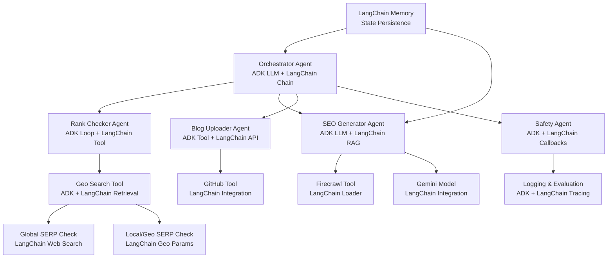

# Agent Architecture Schema (ADK + LangChain Integration)

## Mermaid Diagram Code


## ASCII Diagram
```
Orchestrator Agent (ADK LLM + LangChain Chain)
    |--- LangChain Memory (State)
    |
    +-- Rank Checker Agent (ADK Loop + LangChain Tool)
    |   +-- Geo Search Tool (ADK + LangChain Retrieval)
    |       +-- Global SERP Check (LangChain Web Search)
    |       +-- Local/Geo SERP Check (LangChain Geo Params)
    |
    +-- SEO Generator Agent (ADK LLM + LangChain RAG)
    |   +-- Firecrawl (LangChain Loader)
    |   +-- Gemini (LangChain Integration)
    |
    +-- Blog Uploader Agent (ADK Tool + LangChain API)
    |   +-- GitHub (LangChain Integration)
    |
    +-- Safety Agent (ADK + LangChain Callbacks)
        +-- Logging/Eval (ADK + LangChain Tracing)
```

This schema visualizes the hybrid ADK + LangChain agent2agent flow for automated SEO and blog management.</content>
<parameter name="filePath">C:\Users\Mr. Perfect\coffeeproject\agent_schema.md